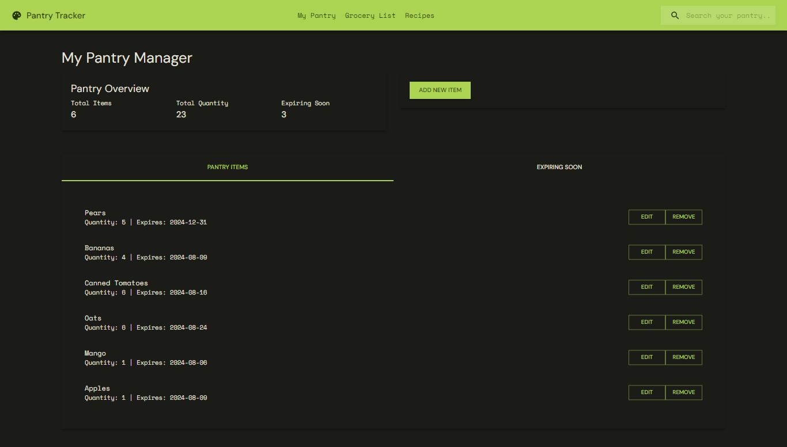
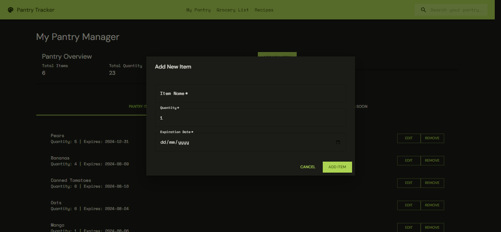
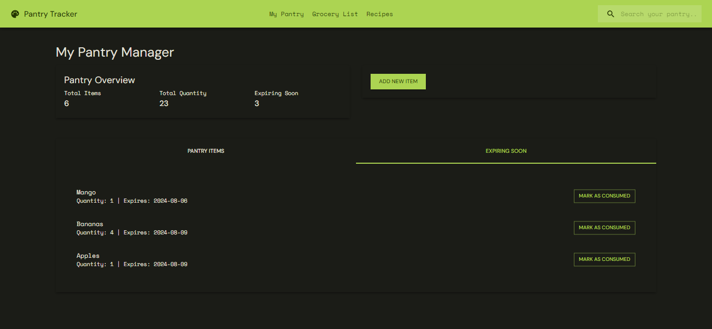
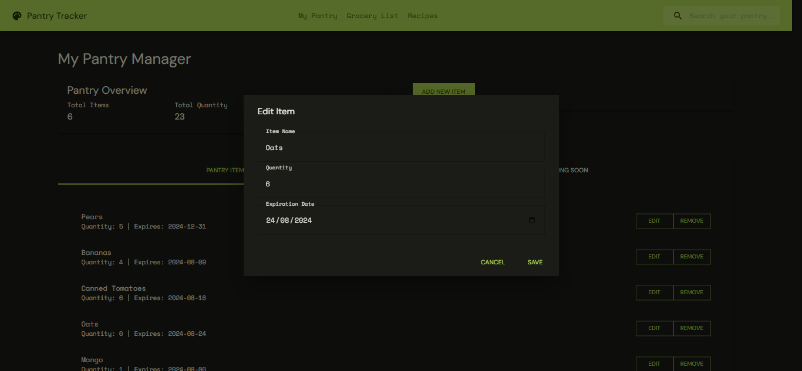

# Pantry Management App

## Project Overview

This project aims to create a web application for managing pantry items. It will utilize Next.js for the frontend, Material UI for components, Firebase for backend data storage, and Vercel for deployment and CI/CD.

## Technologies

- Next.js
- Material UI
- Firebase
- Vercel

## Screenshots









## Features

- CRUD Functions - Add new pantry items with details like name, quantity, expiration date, category. Edit ad delete
- Clear and intuitive interface for managing pantry items
- Mobile-responsive design
- Fourth feature

## Features to Add

- Search and Filtering
- React camera pro Image capturing
- AI Image analysis and classification

## Getting Started

1.Clone the repository:

```bash
git clone https://github.com/tushcmd/pantry-tracker.git
```

2.Install dependencies:

```bash
cd pantry-management-app
npm install
```

3.Set up environment variables:

```bash
cp .env.example .env
```

Edit the `.env` file with your Firebase project credentials and other necessary environment variables.

4.Set up Firebase:

- Create a Firebase project
- Enable the necessary Firebase products (Realtime Database, Authentication, etc.)

5.Run the development server:

```bash
npm run dev
```

Open [http://localhost:3000](http://localhost:3000) with your browser to see the result.

## Contributing

Contributions are welcome! Please feel free to open issues or submit pull requests.

## License

MIT License
